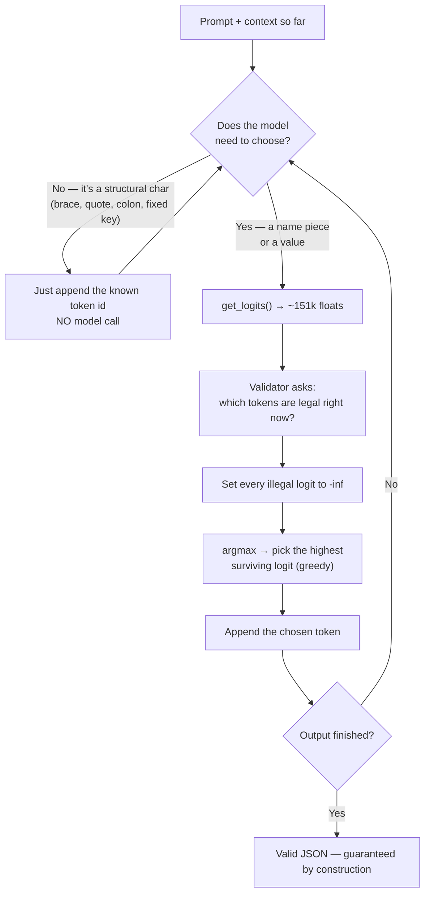

# Constrained Decoding — Defense Study Guide

A plain-language walkthrough of the 11 concepts you must explain out loud. Each one has: what it means in simple terms, an analogy, a concrete example, where it shows up in the real world, and — where it applies — the problem it solves and what breaks if you skip it.

---

## The one-sentence version of the whole project

> You take a language model that *wants* to produce a function call, and instead of *hoping* it produces valid JSON, you make invalid tokens **physically impossible to pick** — so the output is guaranteed to parse and match the schema, while the model still gets to make the smart choices (which function, which values).

Everything below is a piece of that sentence.

### How the 11 pieces connect



Read that loop top to bottom and you've basically explained concepts 1, 2, 5, and 9 in one breath.

---

## 1. Logits and greedy decoding

**In plain English.** When a language model reads a sequence of tokens and has to guess the *next* one, it doesn't output a word — it outputs a **score for every single token in its vocabulary**. Qwen's vocabulary is ~151,000 tokens, so you get ~151,000 numbers. Each number is a **logit**: a raw, unbounded score (can be negative, positive, huge, tiny) saying "how much I'd like *this* token to come next."

Logits aren't probabilities yet. To turn them into probabilities you apply **softmax**: exponentiate each logit and divide by the total, so they all become positive and add up to 1. Higher logit → higher probability.

**Greedy decoding** = the simplest possible choice: just pick the token with the **highest** logit. No randomness, no sampling — same input always gives the same output. Because softmax preserves order (highest logit = highest probability), you can pick the argmax of the logits directly and skip softmax entirely.

**The twist in this project:** you do greedy decoding, but you **edit the logits first**. You'll shove the illegal ones down to negative infinity, *then* take the argmax.

**Analogy.** Think of the model as a very opinionated contestant. For every word in the dictionary it shouts a confidence number (the logit). Softmax is the scorekeeper converting all that shouting into clean percentages that sum to 100%. Greedy decoding is the host saying "we'll always go with your single most confident pick."

**Example.** Given `"2 + 3 = "`, the model's logits might rank `"5"` highest, `"6"` a bit lower, `"apple"` deeply negative. Greedy picks `"5"`.

**Why -inf specifically?** Because after softmax, `e^(-inf) = 0`. A token with logit `-inf` (or `-1e9` in practice) ends up with exactly **zero** probability, so it can never be the argmax. That's the clean mechanical trick that makes constrained decoding work.

**Real-world use.** Autocomplete, code completion (Copilot-style), machine translation. Greedy is the go-to when you want **deterministic, reproducible** output.

**What breaks if you misunderstand this.** If you think logits are already probabilities, you might try to mask *after* softmax (multiply the banned ones by 0 and re-normalize) — slower and fiddlier. Masking at the **logit** level with -inf is the correct, efficient move. Getting this wrong is the difference between an elegant solution and a hacky one the corrector will poke holes in.

---

## 2. Autoregressive generation

**In plain English.** A model can only produce **one token at a time**. To write a whole sentence it runs a loop: predict a token, glue it onto the end of the input, feed the *whole thing* back in, predict the next token, glue it on, and repeat. "Auto-regressive" literally means it **regresses on (depends on) its own previous outputs**. Every new token is chosen based on *everything* generated so far.

**This loop is your entire program.** Because *you* control what goes back into the model each round, you get two superpowers: you can **inject** tokens you already know (structural characters), and you can **intercept and edit** the logits at the moments that matter.

**Analogy.** Writing a sentence one word at a time where the delete key is broken. Before each new word you re-read the whole sentence so far, then commit to the next word forever. Or a snowball rolling downhill — each moment is built on everything that came before.

**Example.**
```
Step 1: input = "The capital of France is"      → picks " Paris"
Step 2: input = "The capital of France is Paris" → picks "."
Step 3: input = "The capital of France is Paris." → picks <end>
```

**Real-world use.** When ChatGPT streams text to you word by word, you are literally watching autoregression happen live. GPS turn-by-turn directions are the same shape: the next instruction depends on where you currently are.

**Why it matters here.** The loop is your **control point**. Constrained decoding only works because generation is step-by-step and you sit in the middle of every step deciding what's allowed and what to feed back.

---

## 3. Tokenization and byte-level BPE

**In plain English.** Text is **not** fed to the model as characters or as whole words. It's chopped into **tokens** — subword chunks. The word `"tokenization"` might become `["token", "ization"]`. The tool that does the chopping is a **BPE tokenizer**.

**BPE = Byte Pair Encoding.** It builds its vocabulary by starting from tiny pieces and **repeatedly merging the most frequent adjacent pair** into a single new token. Common combos (like `"th"`, `"ing"`, `"sum"`) earn their own token; rare stuff stays split up.

**Byte-level** means it works on raw bytes underneath, so it can represent *literally any text* — any language, emoji, weird symbols — with **no "unknown token" problem**, because worst case it falls back to individual bytes.

**The quirk you must remember (the `Ġ` thing).** In byte-level BPE, a **leading space** isn't stored as a normal space — it's written as the character **`Ġ`** (that's the `˙G`-looking symbol in your subject). So the vocab entry **`"Ġsum"` actually means `" sum"`** — a space followed by `s`, `u`, `m`. Other non-printable bytes also get swapped for stand-in printable characters.

**Why this is critical for you.** Your validator constantly asks "does this token keep my JSON valid?" To answer that you must translate the vocab's mangled spelling back into the **real characters** the token adds. If you naively compare the string `"Ġsum"` against JSON rules, you'll mis-judge whitespace and either wrongly ban valid tokens or wrongly allow bad ones.

**Analogy.** BPE is shorthand/stenography. Super-common combinations get a single squiggle; everything else is spelled out. Byte-level shorthand can transcribe *anything* — even a sneeze — because it can always drop down to individual bytes. And `Ġ` is like a proofreader's mark that secretly means "there's a space here."

**Example.**
```
"Ġsum"   → " sum"   (space + s u m)
"sum"    → "sum"    (no leading space)
```
Those are **two different tokens** with two different ids, and the difference is a single space — which matters a lot when JSON whitespace rules are in play.

**Real-world use.** Every modern LLM tokenizes this way. It's why context windows are measured in *tokens* not words, why API pricing is *per token*, and why models are weirdly bad at "count the letters in 'strawberry'" (they see chunky tokens, not individual letters).

**The problem BPE solves.** Character-level tokenization makes sequences painfully long and slow. Word-level needs a gigantic vocabulary and still chokes on new or misspelled words (the dreaded "unknown token"). BPE is the sweet spot: a manageable vocab, decent efficiency, and *nothing* is ever unrepresentable.

**What breaks if you ignore the `Ġ` rule.** Your character-level comparisons silently go wrong. You might accept a token that injects an illegal space into your JSON, or reject a perfectly legal token — and your "guaranteed valid" output stops being guaranteed. This is exactly the kind of subtle bug a corrector loves to trigger.

---

## 4. The vocabulary file

**In plain English.** `get_path_to_vocab_file()` gives you **`vocab.json`**, a dictionary mapping **token-string → token-id**, e.g. `{"Ġsum": 1242, ...}`. You **invert** it once to get the reverse map, **id → token-string**. Now, for any token id the model might pick, you can instantly answer the make-or-break question:

> "If the model picks token #X, exactly which characters does it add to my output?"

Without that answer, you literally cannot decide which tokens are legal — so you cannot mask.

**Two ways to get a token's text:**
- `decode([id])` — asks the tokenizer. Works fine, allowed in the mandatory part.
- **Invert the vocab file yourself** — build the `id → string` dict once at startup. This is **faster** (an O(1) dictionary lookup instead of a function call, repeated ~151k times per step), cleaner, and it's **required** for the tokenizer-recoding bonus.

**Analogy.** It's a decoder ring / lookup table. `1242 → " sum"`. Like a phone book, but instead of name→number it's token-id→characters.

**Example.**
```python
vocab = json.load(open(vocab_path))     # "Ġsum" -> 1242
id_to_str = {v: k for k, v in vocab.items()}   # 1242 -> "Ġsum"
id_to_str[1242]   # "Ġsum"  →  which you translate to " sum"
```

**Real-world use.** Any time engineers debug tokenization, they inspect the vocab to see what the model actually "sees."

**What breaks without it.** No id→string map means you can't tell what a candidate token would produce, so you can't judge legality, so constrained decoding is impossible. And if you use the slow route (`decode()` called 151k times per step) you may blow the time budget.

---

## 5. Constrained decoding = logit masking  ⭐ (the heart of the project)

**In plain English.** This is the whole idea in one move. At **every** generation step:

1. Get the logits (~151k floats).
2. Ask a **validator**: "given what I've built so far, which tokens are allowed next?"
3. Set the logit of **every disallowed token to -inf**.
4. Take the **argmax** of what survives.
5. Append it, feed back, repeat.

Because you *only ever pick from tokens that keep the output valid*, the final string is **guaranteed** to parse and match the schema. Validity stops being probabilistic ("probably fine") and becomes **structural** ("cannot possibly be broken"). The model still supplies the intelligence — it's the one deciding, among the *legal* options, to extract the `"2"` and the `"3"`, to pick the right function — but it can never emit garbage.

**Analogy.** A train on rails. The model is the engine: it decides speed and which valid switch to take at junctions. But it physically cannot leave the track. Or: a form where a field is a **dropdown**, not a free-text box. You might pick the wrong valid option (a *content* mistake), but you can't type gibberish (a *structural* mistake) — the invalid choices simply aren't offered.

**Example.** You've generated `{"name": "` and you're spelling out the function name. The trie says the only still-possible names are `sum` and `subtract`. So the only legal next tokens are those that extend `s...` toward one of those. Every other token's logit → -inf. Between the legal ones, the model's own logits decide (maybe it "wants" `sum`). It can never accidentally type `{"name": "xkcd`.

**Real-world cases.** This is a live, widely-used technique:
- **OpenAI's JSON mode / Structured Outputs** — guarantees responses match a schema.
- **`outlines`, `guidance`, `jsonformer`** — Python libraries built entirely around constrained decoding.
- **`llama.cpp` GBNF grammars** — constrain local models to a grammar.
- **Agent / tool-calling frameworks** — where the model's output must be a valid API call.

**The problem it solves.** A raw LLM outputs a *string*. If a downstream system needs strict JSON (to call a function, hit an API, write to a database), a single stray token — a missing brace, a trailing comma, a hallucinated key, an apology sentence — breaks the parse and **crashes your pipeline**.

**What breaks if you don't do it.** You're stuck with "maybe-valid" output. Teams paper over this with retry loops, regex patching, and parse-with-fallbacks — and at any real scale, some fraction *always* fails. Constrained decoding drives that failure rate to **exactly zero**, by construction. That guarantee is the entire point of your project.

---

## 6. The validator is a grammar / state machine

**In plain English.** The validator is the thing that, given the partial output so far, knows **what's legal next**. You do **not** need a general-purpose JSON parser — you already know the *exact shape* you want. So you break the output into segments and give each segment a tiny **state machine**.

A **state machine** is just: you're in some *state*, an input (a token) either moves you to a valid next state or is rejected, and "the legal next tokens" = "the transitions that exist from your current state." That's it.

Here are the four segment types and their machines:

- **Function name → a trie (prefix tree)** of the allowed names. A trie branches character by character; at any node, the legal next characters are that node's children. As you spell out the name, only tokens that extend a **still-possible** name stay legal. The model's logits **break ties between the surviving names** — and *this is precisely how "the LLM chooses the function" with zero heuristics.*
- **A number → a small finite-state machine** for JSON numbers: an optional `-`, then digits, an optional **single** `.`, then more digits. Only sign/digit/dot tokens are legal, plus a way to signal "number's done."
- **A string → force an opening `"`**, then allow string-content tokens (never a raw unescaped `"` or `\`), until the model chooses the **closing `"`**.
- **A boolean → the allowed set is just the pieces of `true` / `false`.** Nothing else can appear.

**Analogies.**
- **State machine** → a traffic light or a turnstile: a handful of states, clearly defined transitions, no other moves possible.
- **Trie** → predictive text. Type `"su"` and the tree narrows to only words starting with `su`. The remaining branches are your legal next characters.
- **Number FSM** → the rules your calculator display enforces: it won't let you type two decimal points.

**Example — the trie in action.** Names allowed: `sum`, `subtract`, `multiply`.
```
        root
        /  \
      s      m
      |      |
      u    ultiply
     / \
   sum  subtract
```
After the model has produced `su`, the machine says: the only legal continuations lead to `sum` or `subtract`. `multiply` is already dead. `banana` was never on the tree.

**Real-world use.** Regex engines *are* state machines. Compilers and parsers run on grammars. Form validators, vending-machine logic (accept coins until price is met), traffic systems — all finite-state machines.

**The problem it solves / what breaks without it.** Without a validator, there is no notion of "legal next token," so masking has nothing to go on — constrained decoding collapses. And a full JSON parser would be the *wrong* tool: it would happily allow *any* valid JSON, not specifically **your function-call shape**. The tiny per-segment machines constrain toward exactly the structure you want, and they're small enough to prove correct in your head — which is gold in a defense.

---

## 7. The two-stage design (recommended)

**In plain English.** Don't try to build one enormous grammar covering *all* functions and *all* their parameters at once — it's a combinatorial mess and hard to defend. Split the job:

- **Stage 1 — pick the name.** Feed the model your context + prompt. **Force** the opening `{"name": "`. Then constrain generation to the **name trie** until one full name is matched. Then **force** the closing `"`.
- **Stage 2 — fill the parameters.** Now you *know the function*, so from the schema you know its **exact** parameter names and types. **Force** `, "parameters": {`. Then for each parameter, **force** `"<param>": ` (parameter names are fixed — *not* model-chosen) and constrain **only the value** according to its type. Close with `}}`.

This keeps every state machine small and obviously-correct, and it maps one-to-one onto the schema's structure — extremely defensible.

**Analogy.** A branching questionnaire. Your first answer decides which follow-up form you get. Pick "international flight" and the form *knows* to ask for a passport number next. Nobody builds one giant mega-form containing every field for every scenario — you branch, and each branch is simple.

**Example.**
```
Stage 1:  {"name": "        → [trie constrains]  sum        → "
Stage 2:  , "parameters": {  "a":                [number FSM] 2  ,  "b":  [number FSM] 3  }}
Final  :  {"name": "sum", "parameters": {"a": 2, "b": 3}}
```
Notice: after Stage 1 collapses the problem to a single known function, Stage 2 is trivial — you're just forcing fixed keys and constraining a couple of values.

**Real-world use.** Setup wizards, multi-step web forms, dialogue trees in games, multi-pass compilers. All of them branch first, then handle the now-narrowed sub-problem.

**What breaks with the one-giant-grammar approach.** It's harder to write, far harder to prove correct, more bug-prone, and much harder to explain under questioning. The two-stage version is strictly easier to build *and* to defend — which is exactly why the subject recommends it.

---

## 8. Why this beats prompting (say this clearly in the defense)

**In plain English.** **Prompting** means asking the model nicely — "respond ONLY with valid JSON, no extra text" — and *hoping* it complies. But every single token is a fresh chance to derail: a stray apology, a markdown fence, a missing brace.

**Constrained decoding** makes invalid tokens **unpickable**. Validity isn't "very likely" — it's **structurally impossible to break**.

But here's the nuance the corrector wants to hear: prompting still matters, just for a **different job**.

- **Prompting drives *accuracy*** — good context makes the model's *legal* choices the *right* ones (it correctly grabs the `2` and the `3`, picks the correct function).
- **Constraint drives *validity*** — structure comes from the rails, not the request.

So: **prompt to hit the ~90% accuracy target, constrain to hit the 100% validity target.** They're complementary, not competing.

**Analogy.** Prompting is a road sign saying "please stay in your lane." Constraining is a **concrete guardrail**. The sign helps drivers *aim* correctly; the guardrail makes leaving the road *physically impossible*. You want both: signs so they head the right way, guardrails so they can't crash.

**Real-world case.** Early GPT-3 apps wrote elaborate "output only JSON, I'm begging you" prompts — and *still* got prose leaking in, markdown code fences, and "Sure! Here's your JSON:" preambles that broke every parser. The fix wasn't a better prompt; it was moving the guarantee down to the **decoding** level (Structured Outputs). Prompt-only reliability tops out below 100% no matter how clever the wording.

**What breaks with prompt-only.** Some fraction of outputs *always* fails, unpredictably. You cannot promise a downstream system "this will always parse." A single unlucky token defeats you. Constrained decoding is the only approach that gives a hard guarantee.

**The one line to memorize:** *Prompting shapes what the model **wants** to say (accuracy); constraining bounds what the model **can** say (validity).*

---

## 9. Only call the model at decision points (the key performance idea)

**In plain English.** Many characters in the output are things **you** decide, not the model: `{`, the literal key `"name"`, `:`, `,`, the fixed parameter names, the closing braces. The model has *no meaningful opinion* on whether there should be a colon after `"name"` — the schema already dictates it.

So for those structural characters, you **just append their token ids** to the running context — **without calling `get_logits`**. You only spend a forward pass when the model genuinely has to **choose**: each piece of the **function name**, and each piece of a **value**.

That turns ~30 model calls per prompt into maybe **5–10**. It's the difference between "comfortably under 5 minutes" and "painfully slow." Mention it **unprompted** in your defense — it shows you understand where the cost actually is.

**Why forward passes are the expensive part.** Every `get_logits` call runs the *entire* neural network (billions of parameters) forward once. That's the costly operation. Appending a token id you already know is basically free by comparison.

**Analogy.** You're filling out a form with a brilliant but **slow, pay-per-question** consultant. You don't ask them "should there be a colon here?" — the form already fixes that. You only consult them for the *actual answers* (the customer's name, the amount). Everything boilerplate, you fill in yourself, instantly.

**Example.**
```
{"name": "     ← you type this whole thing, 0 model calls
sum            ← MODEL CHOOSES (a few calls, one per name piece)
", "parameters": {"a":   ← you type this, 0 model calls
2              ← MODEL CHOOSES (value)
, "b":         ← you type this, 0 model calls
3              ← MODEL CHOOSES (value)
}}             ← you type this, 0 model calls
```
Roughly 4–6 model calls instead of one per character.

**Real-world use.** This is the same instinct behind KV-caching, prompt caching, and speculative decoding — *don't redo expensive model work you don't have to.* Your version is the most direct form: skip the model **entirely** for tokens you already know.

**What breaks if you don't do this.** Your output is still correct, but you call the model for **every** brace, quote, and colon — 3–6× more forward passes. You blow the time budget and **fail the performance requirement** even though the logic is right. Correct-but-too-slow still fails.

---

## 10. Pydantic and schema

**In plain English.** **Pydantic** is a Python library where you declare a class with **typed fields**, and it **enforces those types at runtime** when you build an object from raw data (like parsed JSON). If the data doesn't fit the declared shape, it raises a clear `ValidationError` that says *exactly* what's wrong. Every class in your project must use it, for **two jobs**:

- **(a) Validate the input files.** Parse `functions_definition.json` and the test files into typed pydantic models. Malformed input is then caught at the door with a **clear, specific error** — not a confusing crash five functions deep.
- **(b) Validate your own output before writing it.** A final safety net: confirm the keys and types of the thing you generated actually match the schema before you save it.

**Analogy.** A bouncer with a checklist at the door. Data tries to enter; if `name` isn't a string, or `parameters` isn't a dict, it's turned away with a precise reason ("`a` must be an int, got `'hello'`"). Nothing malformed gets inside your program to cause trouble later.

**Example.**
```python
from pydantic import BaseModel

class FunctionDef(BaseModel):
    name: str
    parameters: dict[str, str]   # param name -> type

FunctionDef(name="sum", parameters={"a": "int"})   # ok
FunctionDef(name=123,   parameters={"a": "int"})   # ValidationError: name must be str
```

**Real-world use.** **FastAPI** (one of the most popular Python web frameworks) is built on pydantic — it validates every incoming API request this way. Config loading, data-ingestion pipelines, and any boundary where **untrusted external data** enters a typed program all lean on it.

**The problem it solves.** Raw JSON is untyped. You might *assume* `params["a"]` is a number, but it arrives as a string, and your program crashes deep inside some math function with a cryptic traceback. Pydantic catches the mismatch **at the boundary, immediately, in plain language.**

**What breaks without it.** Errors surface **late** and **confusingly**, deep in your logic, as ugly stack traces. Malformed input can silently corrupt your output. And in the defense, "how do you validate input?" answered with "I check keys by hand with a bunch of `if` statements" sounds fragile — versus "typed pydantic models that reject bad data with a clear message," which sounds like real engineering. Note the nice symmetry: even though the *project* is about constraining the **output**, pydantic is your belt-and-suspenders proof that the output truly conforms, *and* your guard so a bad input file fails loudly instead of mysteriously.

---

## 11. Error handling

**In plain English.** The subject hammers on this and **will test it**: missing files, invalid JSON, an empty function list, an empty parameter set, weird prompts. Every one of these must produce a **clear message** and **never a raw stack trace**. You get there with `try`/`except` around risky operations and **context managers** (`with open(...)`) everywhere you touch the filesystem.

A **context manager** (`with open(...) as f:`) guarantees the file is **properly closed even if an error explodes mid-read** — no leaked file handles, no locked files. It's the safe, idiomatic way to handle resources.

**Analogy.** Defensive driving with airbags. You *assume* things will go wrong and prepare a graceful response ahead of time. Good software treats bad input as **expected**, not as a shocking exception it wasn't ready for.

**Example.**
```python
try:
    with open(path) as f:
        data = json.load(f)
except FileNotFoundError:
    print(f"Error: could not find '{path}'. Check the file path.")
    return
except json.JSONDecodeError:
    print(f"Error: '{path}' is not valid JSON.")
    return
```
A truncated file now prints one clear line instead of a 15-line traceback.

**The specific edge cases named in the subject — handle each explicitly:**
- **Missing file** → catch `FileNotFoundError`, print a helpful "can't find X" message.
- **Invalid JSON** → catch `json.JSONDecodeError`, say the file isn't valid JSON.
- **Empty function list** → there's nothing to choose from; report it cleanly instead of looping forever or crashing.
- **Empty parameter set** → the function takes no arguments; output `"parameters": {}` — don't try to constrain a value that doesn't exist.
- **Weird prompt** → still produce valid output or a clean message; never explode.

**Real-world use.** This *is* production software. A user renames a file → your program says "Cannot find `functions_definition.json`, please check the path" instead of vomiting a traceback. Every robust CLI tool, server, and pipeline does this.

**The problem it solves / what breaks without it.** A crash with a raw traceback is unprofessional, leaks your internal file structure, and leaves the user with no idea what to do. Graceful handling keeps your program **in control** and **communicative**. In the defense, the corrector *will* feed you an empty file or a typo'd path on purpose — if your program blows up, you **fail the robustness checks**. Handle it, and you demonstrate exactly the maturity they're grading for.

---

## Quick-recall cheat sheet

| # | Concept | One-line defense answer |
|---|---------|------------------------|
| 1 | Logits & greedy | Raw per-token scores; softmax→probabilities; pick the max (after masking with -inf). |
| 2 | Autoregressive | Generate one token at a time, feed each back; the loop is my control point. |
| 3 | Byte-level BPE | Text→subword tokens; a leading space is `Ġ`, so `"Ġsum"` means `" sum"`. |
| 4 | Vocab file | `vocab.json` gives token→id; I invert it to id→string to know what each token adds. |
| 5 | Constrained decoding | Mask illegal tokens' logits to -inf, then argmax → validity is guaranteed, not hoped for. |
| 6 | Validator = state machine | Tiny per-segment machines (trie for names, FSM for numbers, etc.) that know what's legal next. |
| 7 | Two-stage design | Stage 1 pick the name (trie); Stage 2 fill known params by type. Keeps each machine simple. |
| 8 | Beats prompting | Prompt = accuracy (what it *wants*); constraint = validity (what it *can*). Guardrails, not signs. |
| 9 | Decision-points only | Skip the model for structural chars; call it only for name/value pieces → ~5–10 calls, fast. |
| 10 | Pydantic | Typed models validate input *and* my output; bad data is rejected clearly at the boundary. |
| 11 | Error handling | `try/except` + `with open`; every edge case → clear message, never a stack trace. |

**If you can explain the mermaid diagram at the top and this table out loud, you can defend the project.**
